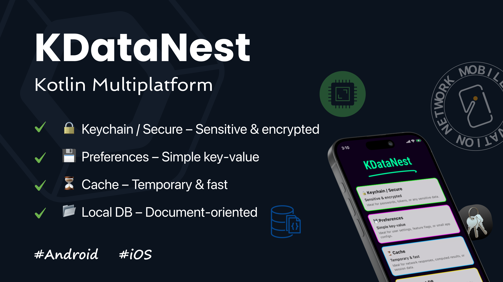
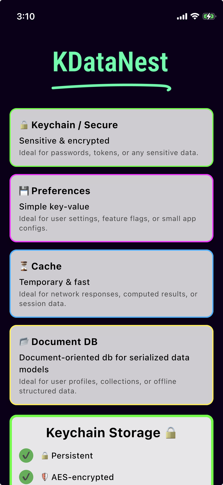
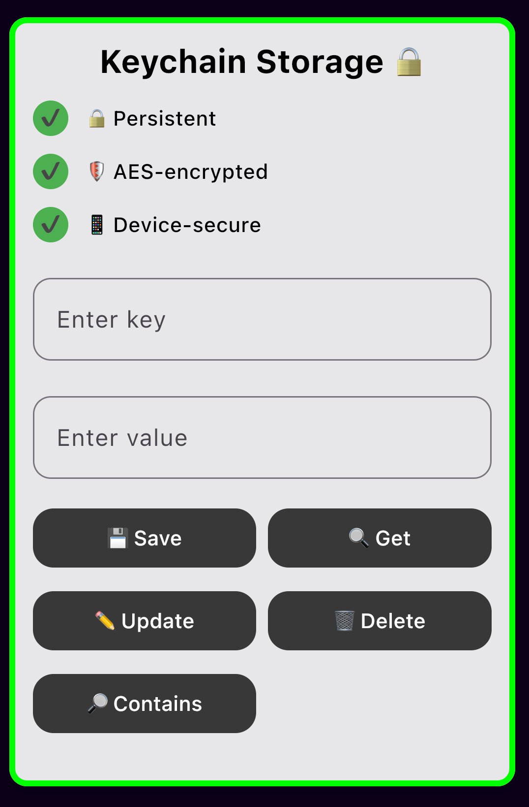

# 🧩 KDataNest
> The **Swiss Army Knife of Storage Solutions** for **Jetpack Compose Multiplatform** — combining **secure keychain storage**, **preferences**, **cache**, and a **document-style local database** in one unified, type-safe library.

[](https://central.sonatype.com/artifact/network.chaintech/cmpautocompletesearchbox)
[](http://kotlinlang.org)
[](https://github.com/JetBrains/compose-multiplatform)
[](http://www.apache.org/licenses/LICENSE-2.0)


  

KDataNest is a Kotlin Multiplatform library providing a **secure, fast, and flexible storage solution** for Android and iOS. It combines **Keychain/Encrypted storage**, **UserPreferences**, **Cache**, and **Local Database** features with migration and versioning support, making it easy to persist and manage your app data.
---

 

## ✨Features

- 🔐 **Keychain Storage / Secure Storage** – Store sensitive data securely across platforms.
- ⚙️ **User Preferences** – Simple key-value storage for app settings.
- 🗃️ **Cache Storage** – Temporary storage with TTL support for fast retrieval.
- 🗄️ **Local Database** – Document-oriented storage using Kotlin Multiplatform SQLDelight.
  - 🔄 **Migrations** – Safely upgrade database schema and transform documents.
  - 🛡️ **Type-Safe Serialization** – Works with Kotlinx Serialization models.
  - 🔍 **Search & Query Helpers** – Filter documents with lambda-based queries.

---

## 📦Installation

Add the KDataNest library to your Kotlin Multiplatform project:

```kotlin
// CommonMain
dependencies {
  implementation("network.chaintech:kdatanest:1.0.0")
}
```

---

## 🚀 Quick Start / Usage

### 🔐 Keychain Storage

Securely store sensitive data such as tokens or passwords.

- 🔑 Store encrypted sensitive data
- 🔒 Platform-secure storage on Android & iOS
- 🧠 Persists even after uninstalls on iOS and until uninstalls on Android
- 🔄 Simple CRUD operations
- 🔍 Check existence of keys

```kotlin
val keychainStorage = KeychainStorageFactory.create()

// Save
keychainStorage.save("apiToken", "123456")

// Retrieve
val token = keychainStorage.get("apiToken")

// Update
keychainStorage.update("apiToken", "654321")

// Delete
keychainStorage.remove("apiToken")

// Check existence
val exists = keychainStorage.contains("apiToken")
```

---

### ⚙️ Preferences Storage

Store simple key-value pairs for app settings or user preferences.

- ⚙️ Store app settings and flags
- 🧠 Persists until uninstalls
- 🗝️ Key-value pairs with optional encryption
- 🔄 CRUD support
- 🔍 Existence checks

```kotlin
val preferences = PreferenceFactory.create()

// Save a preference
preferences.save("darkModeEnabled", true)

// Retrieve a preference
val darkMode = preferences.get<Boolean>("darkModeEnabled")

// Update a preference
preferences.update("darkModeEnabled", false)

// Remove a preference
preferences.remove("darkModeEnabled")

// Check if a preference exists
val hasPref = preferences.contains("darkModeEnabled")

// Clear all preference values
preferences.clearAll()
```

---

### 🗃️ Cache Storage

Use cache storage for temporary data with expiration (TTL).

- ⏳ Supports TTL (time-to-live) for cache entries
- ⚡ Fast retrieval of cached data
- 🔄 CRUD operations with expiration awareness
- 🚫 Automatically removes oldest entries when limit exceeded

```kotlin
val cache = CacheStorageFactory.create()

// Save cache with TTL (in seconds)
cache.put("userProfile", userObj, ttl = 10.minutes)

// Retrieve cache
val cachedProfile = cache.get<UserProfile>("userProfile")

// Check if cache exists and is valid
val isCacheValid = cache.contains("userProfile")

// Remove cache entry
cache.remove("userProfile")

// Set cache count limit
cache.countLimit = 3

// Clear all cached entries
cache.clearAll()
```

---

### 🗄️ Local Database (Document-Oriented NoSQL Layer for serialized models)

KDataNest abstracts SQLDelight into a document-oriented NoSQL database, allowing you to store and query JSON-like documents with schema migrations and versioning.

- 🗂️ Collections of JSON-like documents
- 𝌭  Seamlessly use Serialized models to store and retreive.
- 🧠 Persists until uninstalls
- 🛠️ Schema migrations with versioning support
- 🔍 Query documents with lambda filters
- 🔄 CRUD operations with type-safe serialization
- 🔧 Migration example included


#### Start by installing the kotlinx-serialization library (if not already installed)

in your root level build.gradle.kts file, add this
```kotlin
plugins {
  id("org.jetbrains.kotlin.plugin.serialization") version "2.2.20" apply false
}
```

And in your module level build.gradle.kts file, add this
```kotlin
plugins {
  id("org.jetbrains.kotlin.plugin.serialization") version "2.2.20"
}

sourceSets {
  commonMain.dependencies {
    implementation("org.jetbrains.kotlinx:kotlinx-serialization-json:1.9.0")
  }
}

```

```kotlin
val driver = createDriver()
val dbQueries: DatabaseQueries = Database(driver).databaseQueries
val db = DocumentDatabase.create(queries = dbQueries)

// Define a data model (using kotlinx.serialization)
@Serializable
data class Note(val id: String, val title: String, val content: String)

// Save a document
val note = Note(id = "note1", title = "Shopping List", content = "Milk, Eggs, Bread")
db.save("notes", id = note.id, model = note)


// Save multiple documents
val note2 = Note(id = "note2", title = "Task List", content = "Study, Jog, Walk")
val note3 = Note(id = "note3", title = "Reading List", content = "Atomic Habits, Jane Austen, Zero to 100")
val note4 = Note(id = "note4", title = "Watch List", content = "Dexter, Hannibal, Monster")
db.saveAll("notes", listOf(note2,note3,note4))

// Retrieve a document
val savedNote = db.find("notes", "note1")

// Query documents with a filter lambda
val shoppingNotes = db.query<Note>("notes") { note ->
    note.title.contains("Shop")
}

// Update a document
db.update<Note>("notes", "note1") { note ->
    note.copy(content = "Milk, Eggs, Bread, Butter") // add item and update only the content
}

// Delete a document
db.delete("notes", "note1")
```

## Migrations
Suppose you want to upgrade your database by adding a shiny new subtitle field to your notes 📝 — but you don’t want any pesky null values lurking in your existing data.

That’s where migrations come to the rescue! 🚀

Migrations are your database’s way of leveling up whenever you change the schema or need to transform existing data to support cool new features. Some common reasons to run a migration include:
•	✨ Adding new fields with default values
•	🔄 Renaming properties
•	🛠 Updating data formats

Do it right, and your data stays consistent, your app keeps running smoothly, and you avoid those “oh no” moments! 😎

**WARNING:** ⚠ It is crucial to run migrations immediately after creating or opening the database and before performing any queries or data operations. Failing to run migrations first may lead to crashes or inconsistent data states since the database schema and stored documents might not match the expected structure.

```kotlin
// Migration example
@Serializable
data class NewNote(val id: String, val title: String,val subTitle: String, val content: String)
db.migrateIfNeeded(targetVersion = 2) { version ->
    if (version == 2) {
        db.migrateCollection<Note, NewNote>("notes") { oldNote ->
            NewNote(
                id = oldNote.id,
                title = oldNote.title,
                subTitle = "",
                content = oldNote.content
            )
        }
    }
}
```

## More Examples
```kotlin
// Delete a single document
db.delete("notes", "note1")

// Batch delete multiple documents
db.deleteAll("notes", listOf("note2", "note3"))

// Clear a whole collection
db.clearCollection("tasks")

// Count documents in a collection
val noteCount = db.countDocuments("notes")

// Check if a document exists
val exists = db.documentExists("users", "user1")

// Get all document IDs in a collection
val ids = db.getAllDocumentIds("tasks")

// Check if a collection is empty
val isEmpty = db.isCollectionEmpty("logs")

// Get all collections in the database
val collections = db.getAllCollections()

// Get all documents as a list of models
val allUsers = db.getAllDocuments<User>("users")

// Update a document
db.update<User>("users", "user1") { user ->
    user.copy(name = "Alice Cooper")
}

// Schema versioning and migration
db.setSchemaVersion(1)
val version = db.getSchemaVersion()

db.migrateIfNeeded(targetVersion = 2) { version ->
    if (version == 2) {
        db.migrateCollection<User, User>("users") { oldUser ->
            oldUser.copy(email = "${oldUser.name.lowercase()}@example.com")
        }
    }
}
```
---

## How KDataNest Abstracts SQL into a Document-Oriented NoSQL Layer 🗂️

KDataNest leverages Kotlin Multiplatform SQLDelight but exposes a **document-oriented API** to developers. Instead of dealing with raw SQL tables and queries, you work with collections of JSON-like documents identified by unique keys.

- **Collections:** Group documents by collection names (e.g., `"notes"`, `"users"`).
- **Documents:** Store any serializable Kotlin object as a document.
- **Queries:** Filter documents with lambda expressions, enabling flexible search.
- **Migrations:** Seamlessly upgrade schemas and transform documents without losing data.
- **Versioning:** Track document versions to maintain data integrity.

This abstraction allows you to enjoy the power and reliability of SQL databases with the flexibility and simplicity of NoSQL document stores.

### 💡 Note: This is just the beginning! 
#### More features and enhancements for the database are coming soon — KDataNest is only getting started. 🚀

---

## 📊 Comparison of Storage Types

| Feature               | Keychain Storage 🔐                       | Preferences Storage ⚙️          | Cache Storage 🗃️                   | Local Database 🗄️                                   |
|-----------------------|-------------------------------------------|--------------------------------|-----------------------------------|------------------------------------------------------|
| **Purpose**           | Encrypt and Store sensitive data securely | Store app settings and preferences | Temporary data with expiration (TTL) | Persistent document-oriented storage                 |
| **Data Model**        | Key-value pairs                           | Key-value pairs                 | Key-value pairs with TTL           | Serialized models |
| **TTL Support**       | ❌                                         | ❌                             | ✅                               | ❌                                                    |
| **Query Support**     | Limited (by key)                          | Limited (by key)                | Limited (by key)                   | Advanced query with lambda filters                   |
| **Migration Support** | ❌                                         | ❌                             | ❌                               | ✅                                                    |
| **Use Cases**         | Tokens, passwords, secrets                | User preferences, flags         | Cached API responses, temp data    | Complex serialized model data, offline storage, sync |
| **Performance**       | Fast, secure                              | Fast                          | Very fast                        | Moderate (depends on queries)                        |

---

## Get Started Today! 🚀

KDataNest simplifies cross-platform data persistence with a unified, type-safe API. Whether you need secure storage, preferences, caching, or a full-fledged document database, KDataNest has you covered.

For more details, visit the [GitHub repository](https://github.com/Chaintech-Network/KDataNest) and check out the examples.

Happy coding! 🎉

## 🧑‍💻 Author

**Chaintech Network**

Stay connected and keep up with our latest innovations! 💼 Let's innovate together!

[](https://github.com/Chaintech-Network)  
[](https://www.linkedin.com/showcase/mobile-innovation-network)
[](https://medium.com/mobile-innovation-network)

<br>

## 🌟 Support

If you find this library useful:  
⭐ **Star** the repo → it helps others discover it!  
💬 Open an issue or PR if you’d like to contribute.

## 📄 License

```
Copyright 2025 Mobile Innovation Network

Licensed under the Apache License, Version 2.0 (the "License");
you may not use this file except in compliance with the License.
You may obtain a copy of the License at

   http://www.apache.org/licenses/LICENSE-2.0

Unless required by applicable law or agreed to in writing, software
distributed under the License is distributed on an "AS IS" BASIS,
WITHOUT WARRANTIES OR CONDITIONS OF ANY KIND, either express or implied.
See the License for the specific language governing permissions and
limitations under the License.
```